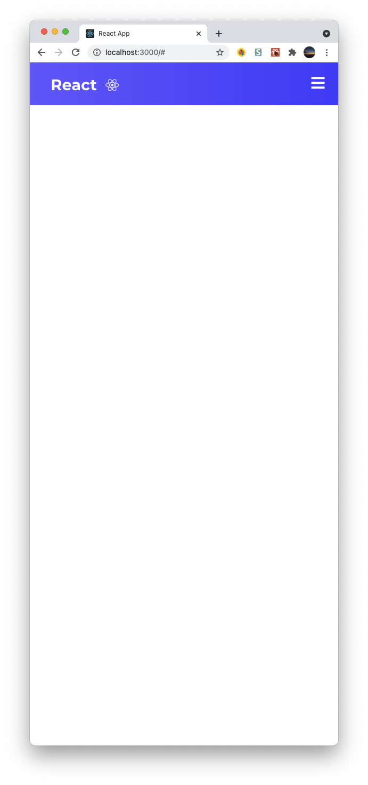

# React NavBar

Credit(https://www.youtube.com/watch?v=fL8cFqhTHwA).

## How to use
In the project directory, you can run:
### `npm start`

## Description
Responsive navbar created with React!

## Screenshot

[1] Desktop

[2] Mobile

